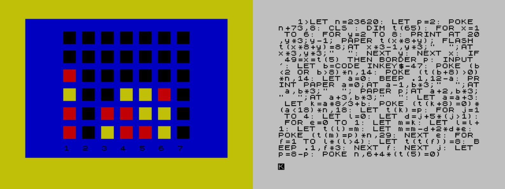

# Connect 4 PvP - a commented source

An incredible one-liner BASIC program for the ZX Spectrum, by [Digital Prawn and Einar Saukas, with additional suggestions by Dr BEEP](http://reptonix.awardspace.co.uk/sinclair/oneliners/connect4-pvp.htm).

[](http://reptonix.awardspace.co.uk/sinclair/oneliners/connect4-pvp.htm)

This is a shining example of functional minimalism in game design, and utter excellence of execution.
The columns are numbered, the border colour shows you whose turn it is, each player presses a number to play their turn.
There is animation. There are simple sound effects. When the game is won, the winning line flashes on screen.
It is a flawless implementation of Connect 4.

It is astonishing that it fits into a single line of BASIC occupying a single screen. My discovery of this feat had motivated me to make [my own one-liner game](https://github.com/patters-syno/line). Although I did use some of the coding tricks that this and [other one-liners](http://reptonix.awardspace.co.uk/sinclair/oneliners/) have employed, I had always wanted to unpick this particular listing to discover how it functions.

## Source files

- **[c4.bas](https://github.com/patters-syno/connect4/blob/main/c4.bas)** is the original listing unrolled into a ```.bas``` file with indentations for readibility, which can be built back into the original ```.tap``` file by [zmakebas](https://github.com/ohnosec/zmakebas).
When a line is wrapped like this, comments cannot be inserted unfortunately - but it does give a good idea of the program flow (minus the pokes to the program counter).

  ```bash
  zmakebas -n Connect4 -o c4_oneline.tap -l -i 10 -s 1 c4.bas
  ```

- **[c4_annotated.bas](https://github.com/patters-syno/connect4/blob/main/c4_annotated.bas)** is this same listing chopped into multiple lines, using labels instead of pokes to jump around, with explanatory comments.
It too can be built by [zmakebas](https://github.com/ohnosec/zmakebas) into a functionally identical Spectrum listing, though no longer a one-liner.

  ```bash
  zmakebas -n Connect4 -o c4_multiline.tap -l -i 10 -a 10 c4_annotated.bas
  ```

<br>

## How It Works - The Grid Array

The main flourish of this program is to store the game layout as a one dimensional array - an elegant solution. The array index for each position is shown below:

|    |    |    |    |    |    |    |
|----|----|----|----|----|----|----|
| 10 | 11 | 12 | 13 | 14 | 15 | 16 |
| 18 | 19 | 20 | 21 | 22 | 23 | 24 |
| 26 | 27 | 28 | 29 | 30 | 31 | 32 |
| 34 | 35 | 36 | 37 | 38 | 39 | 40 |
| 42 | 43 | 44 | 45 | 46 | 47 | 48 |
| 50 | 51 | 52 | 53 | 54 | 55 | 56 |

When checking for lines of four, this only needs to be done right after each token is played, from that token position.
When seen like this, it becomes very clear that:

- a horizontal line can be checked by comparing adjacent array indices
- a vertical line can be checked by comparing array indices with an interval of 8
- a rising diagonal has interval 7
- a falling diagonal has interval 9

Notice also that there is an unused index for each row (17, 25, 33 and so on) - this prevents the algorithm from wrapping from one side of the grid to the other, since it will always encounter an empty slot there, ending the check.

There are four types of line to check for, each with two directions to iterate. What seemed so difficult is distilled down to such simplicity.
